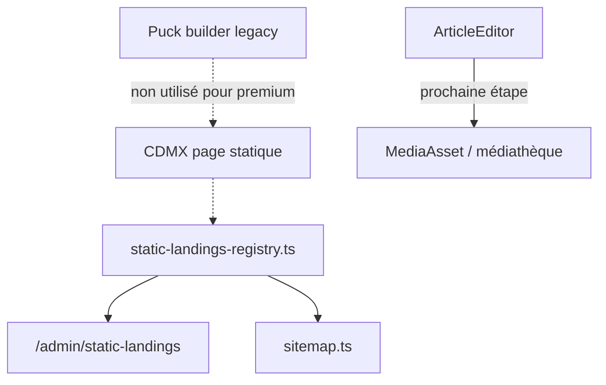

# Roadmap — Landings statiques & admin

## Architecture retenue

Le site distingue trois espaces de production de contenu :

| Espace | Rôle | Outil |
|--------|------|-------|
| **Landings premium statiques** | Pages conversion haute qualité (ex. CDMX) | Code à la main + registre |
| **Builder legacy (Puck)** | Pages locales expérimentales / labo | `/admin/pages` — ne pas utiliser pour le premium |
| **Articles** | SEO / AEO / GEO, contenu éditorial long format | `ArticleEditor` + médiathèque |

## Pourquoi les landings premium restent statiques

La page CDMX (`/es/reset-corporal-frances-cdmx`) est codée à la main dans :

- `src/app/reset-corporal-frances-page.tsx` — composant UI premium
- `src/app/[lang]/reset-corporal-frances-cdmx/page.tsx` — metadata, JSON-LD, canonical
- `src/data/campaign-landings.ts` — config WhatsApp, tracking, copy

Raisons :

1. **Design** — Le builder Puck ne reproduit pas la DA premium attendue.
2. **WhatsApp** — Liens hardcodés stables (`CDMX_WHATSAPP_URL`) indépendants de la DB.
3. **SEO / AEO** — JSON-LD Service + FAQPage + BreadcrumbList intégrés au code.
4. **Fiabilité** — La page fonctionne sans seed DB ni dépendance CMS.

**Ne pas migrer CDMX vers Puck.**

## Rôle du registre

Fichier : `src/data/static-landings-registry.ts`

- Source de vérité pour les landings statiques premium (hors DB).
- Alimente la console admin `/admin/static-landings` (visibilité, pas d'édition).
- Alimente le sitemap via `getLiveIndexableStaticLandings()` (LIVE + indexable + sitemap).

Pour ajouter une nouvelle landing statique premium :

1. Coder la page et la route publique.
2. Ajouter une entrée au registre avec tous les champs requis.
3. Vérifier dans l'admin et dans le sitemap.

## Rôle du sitemap

Fichier : `src/app/sitemap.ts`

Ordre des sources (avec déduplication par URL) :

1. Pages statiques du site (`STATIC_ROUTES`)
2. Landings statiques du registre (`staticLandingPages`)
3. Articles publiés (DB)
4. Growth pages LIVE (DB)

Le registre garantit que `/es/reset-corporal-frances-cdmx` est **toujours** dans le sitemap, même quand la DB fonctionne et pourrait aussi lister cette URL via `landingPage`.

## Rôle de la médiathèque

Fichier admin : `src/app/(admin)/admin/media/page.tsx`

La médiathèque (`MediaAsset`) reste la fondation pour :

- Images des articles
- Assets réutilisables cross-contenu
- Alt text multilingue (à renforcer)

Elle n'est pas encore branchée dans `ArticleEditor` / `TiptapToolbar` — c'est la prochaine étape.

## Rôle du créateur d'articles

Fichiers :

- `src/components/admin/ArticleEditor.tsx`
- `src/components/admin/TiptapToolbar.tsx`
- `src/app/(admin)/admin/articles/[id]/page.tsx`

Les articles sont le vrai espace éditorial SEO/AEO/GEO. Ils ne doivent pas être remplacés par des landings Puck.

## Prochaines étapes (médiathèque + ArticleEditor)

À implémenter dans un chantier dédié :

1. **Bouton « Choisir depuis la médiathèque »** dans `TiptapToolbar` pour insertion d'image inline.
2. **Image de couverture** depuis `MediaAsset` dans `ArticleEditor` (remplacer ou compléter `ImageUploader`).
3. **Alt text FR/EN/ES obligatoire** pour chaque image insérée (validation SEO/AEO).
4. **Preview** de l'asset sélectionné avant insertion.

Fichiers de référence :

- `src/components/admin/ArticleEditor.tsx`
- `src/components/admin/TiptapToolbar.tsx`
- `src/app/(admin)/admin/media/page.tsx`
- `src/lib/upload.ts`

## Ce qu'on ne doit pas faire

- Migrer CDMX (ou toute landing premium) vers Puck.
- Laisser le builder casser la direction artistique des pages conversion.
- Supprimer les fondations CMS (médiathèque, articles, growth DB) trop tôt.
- Supprimer brutalement Puck ou les routes `/admin/pages` — le marquer legacy suffit pour l'instant.
- Changer les routes publiques existantes sans redirection 301.
- Rendre le sitemap dépendant de la DB pour les landings statiques premium.
